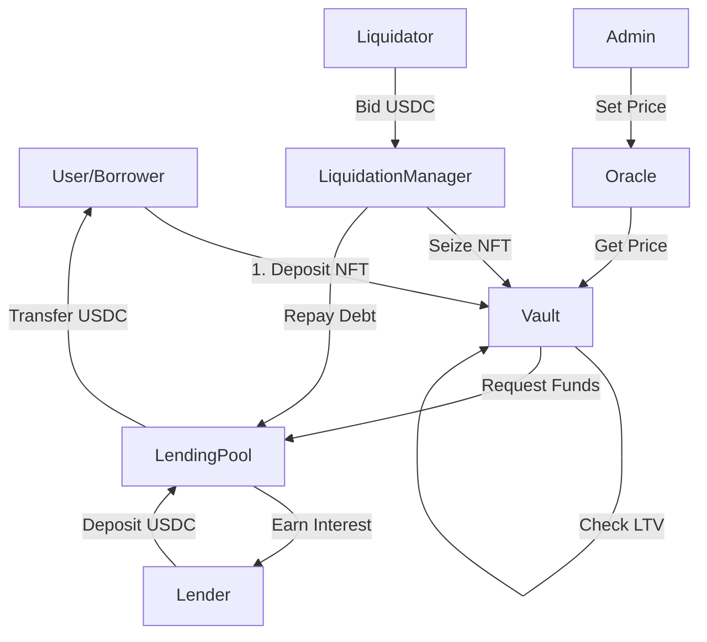

# ⚙️ Cơ Chế Hoạt Động Chi Tiết - RWA Lending Platform

Tài liệu này mô tả sâu về kiến trúc kỹ thuật, luồng dữ liệu và các thuật toán tài chính được sử dụng trong hệ thống RWA Lending Platform.

---

## 1. 🏗️ Kiến Trúc Hệ Thống (System Architecture)

Hệ thống được xây dựng trên mô hình **Pool-based Lending** (Cho vay dựa trên bể thanh khoản), nơi người cho vay (Lenders) gửi tiền vào một bể chung, và người đi vay (Borrowers) vay từ bể đó bằng cách thế chấp tài sản thực đã được token hóa (RWA NFTs).

### Các Thành Phần Chính (Core Components)

| Smart Contract | Vai Trò | Mô Tả Kỹ Thuật |
|---|---|---|
| **RWA_NFT** | Tài Sản | Token chuẩn ERC-721 đại diện cho tài sản thực (Bất động sản, Xe, Vàng...). Chứa Metadata link tới IPFS. |
| **RWA_Oracle** | Dữ Liệu | Lưu trữ giá trị thực của từng NFT (tính bằng USD). Chỉ Admin mới có quyền cập nhật giá. |
| **MockUSDC** | Tiền Tệ | Token chuẩn ERC-20 mô phỏng Stablecoin USDC. Dùng để cho vay và trả nợ. |
| **LendingPool** | Thanh Khoản | Giữ tiền của Lenders. Quản lý việc gửi tiền (Deposit), rút tiền (Withdraw) và tính lãi suất. |
| **Vault** | Kho Bạc | Giữ NFT thế chấp của Borrowers. Quản lý các vị thế vay (Debt Position) và tính toán Health Factor. |
| **LiquidationManager** | Thanh Lý | Quản lý quy trình đấu giá khi tài sản thế chấp bị thanh lý do nợ xấu. |

---

## 2. 🔄 Luồng Hoạt Động (Workflows)

### A. Quy Trình Token Hóa & Định Giá (Tokenization & Valuation)
1.  **Minting**: Admin xác thực tài sản thực tế và tạo ra một `RWA_NFT` tương ứng trên Blockchain. NFT này được chuyển vào ví của chủ sở hữu (Borrower).
2.  **Valuation**: Admin sử dụng `RWA_Oracle` để thiết lập giá trị cho NFT (ví dụ: NFT #1 = $100,000). Giá này là cơ sở để tính hạn mức vay.

### B. Quy Trình Cung Cấp Thanh Khoản (Lending)
1.  **Deposit**: Lender gửi USDC vào `LendingPool`.
2.  **Shares**: Hệ thống ghi nhận số dư tiền gửi của Lender.
3.  **Interest**: Khi có người vay, lãi suất được tích lũy vào Pool. Giá trị tiền gửi của Lender tăng dần theo thời gian.

### C. Quy Trình Vay Thế Chấp (Borrowing)
1.  **Collateralize**: Borrower chuyển NFT của mình vào `Vault` để làm tài sản đảm bảo.
2.  **Borrow Limit**: Hệ thống tính toán hạn mức vay dựa trên **LTV (Loan-to-Value)**.
    *   *Công thức:* `Max Borrow = Asset Price * LTV (60%)`
3.  **Borrow**: Borrower rút USDC từ `LendingPool` về ví. `Vault` ghi nhận khoản nợ (Debt) kèm lãi suất bắt đầu tính.

### D. Quy Trình Trả Nợ (Repayment)
1.  **Repay**: Borrower trả lại USDC (Gốc + Lãi) vào `Vault`.
2.  **Unlock**: Khi nợ = 0, Borrower có thể rút NFT từ `Vault` về ví của mình.

### E. Quy Trình Thanh Lý (Liquidation)
Xảy ra khi giá trị tài sản giảm hoặc nợ tăng khiến khoản vay trở nên rủi ro.

1.  **Trigger**: Khi `Health Factor < 1`.
2.  **Auction Start**: Bất kỳ ai cũng có thể kích hoạt thanh lý. NFT được chuyển sang `LiquidationManager`.
3.  **Bidding**: Các Liquidator (người thanh lý) đặt giá thầu bằng USDC để mua lại NFT giá rẻ.
4.  **End Auction**:
    *   Người trả giá cao nhất nhận NFT.
    *   Tiền đấu giá được dùng để trả nợ cho `LendingPool`.
    *   Phần tiền thừa (nếu có) được trả lại cho Borrower.

---

## 3. 🧮 Công Thức Tài Chính (Financial Formulas)

### 1. Health Factor (Chỉ Số Sức Khỏe)
Dùng để đánh giá độ an toàn của khoản vay.

$$
\text{Health Factor} = \frac{\text{Collateral Value} \times \text{Liquidation Threshold}}{\text{Total Debt}}
$$

*   **Collateral Value**: Giá trị NFT từ Oracle.
*   **Liquidation Threshold**: Ngưỡng thanh lý (ví dụ: 80%).
*   **Total Debt**: Tổng nợ gốc + Lãi suất tích lũy.
*   Nếu **HF < 1**: Tài sản sẽ bị thanh lý.

### 2. Lãi Suất (Interest Rate)
Lãi suất được tính theo mô hình lãi suất đơn giản hoặc lãi kép theo từng giây (per second compounding).

$$
\text{Debt}_t = \text{Debt}_0 \times (1 + r)^t
$$

*   $r$: Lãi suất vay theo giây (APY / 365 / 24 / 3600).
*   $t$: Thời gian vay (tính bằng giây).

---

## 4. 🛡️ Cơ Chế Bảo Mật (Security Mechanisms)

*   **Reentrancy Guard**: Ngăn chặn tấn công Reentrancy trong các hàm rút tiền (`withdraw`, `borrow`).
*   **Access Control**: Chỉ Admin mới có quyền Mint NFT và Set Price. Chỉ Vault mới có quyền rút tiền từ LendingPool.
*   **Checks-Effects-Interactions**: Tuân thủ quy tắc lập trình Solidity để đảm bảo trạng thái được cập nhật trước khi chuyển tiền.
*   **SafeERC20**: Sử dụng thư viện an toàn cho các giao dịch Token.

---

## 5. 🔗 Tương Tác Giữa Các Contract

---
*Tài liệu này giúp Developers và Auditors hiểu rõ cách hệ thống vận hành bên dưới giao diện người dùng.*
